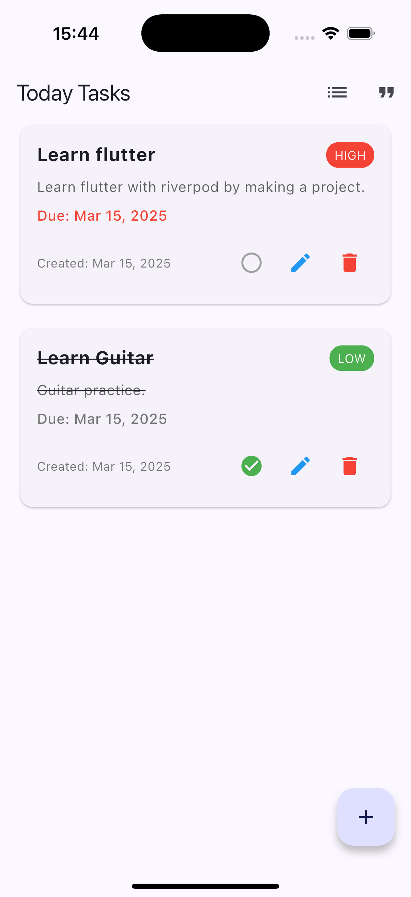
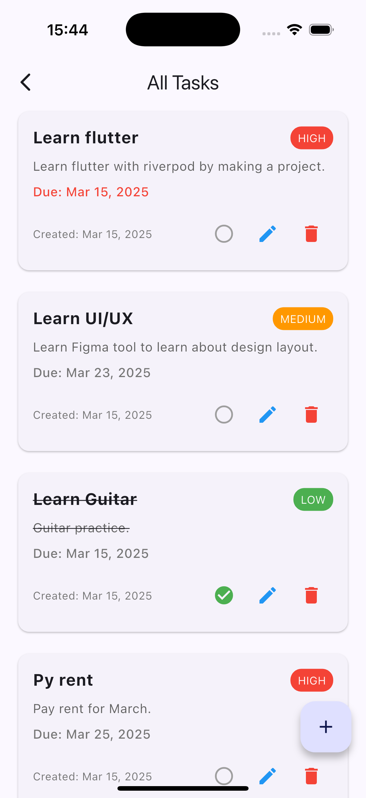
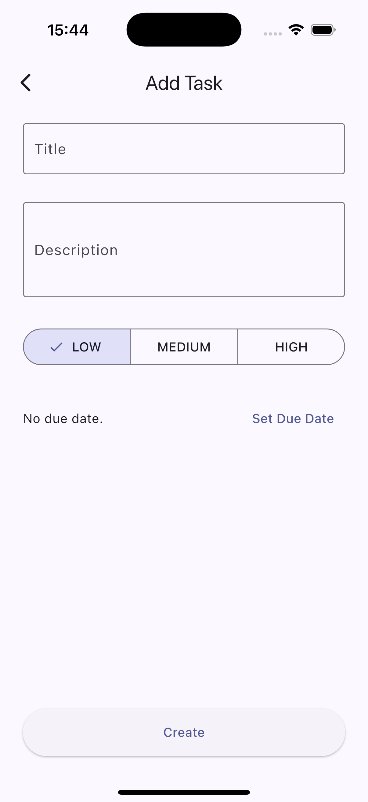

# Dailoz - Daily Task Management App

Dailoz is a feature-rich Flutter application designed to help users manage their daily tasks efficiently while providing motivational quotes for inspiration.

## Screenshots

<p align="center">
  
  
  
  
</p>

## Features

### Task Management
- **Create Tasks**: Add new tasks with title, description, due date, and priority level
- **Edit Tasks**: Modify existing tasks as needed
- **Delete Tasks**: Remove tasks that are no longer needed
- **Mark as Complete**: Track task completion status
- **Priority Levels**: Assign low, medium, or high priority to tasks
- **Due Dates**: Set and track task deadlines
- **Today's Tasks**: Quick view of tasks due today

### Motivational Quotes
- **Daily Inspiration**: Access motivational quotes to stay inspired
- **Refresh Quotes**: Get new quotes with a simple pull-to-refresh gesture
- **Beautiful Display**: Elegantly formatted quote cards with author attribution

## Architecture Overview

Dailoz follows the Clean Architecture pattern, separating concerns into distinct layers:

### 1. Presentation Layer
- **Screens**: UI components that users interact with
  - HomeScreen: Displays today's tasks and provides navigation
  - TaskListScreen: Shows all tasks with filtering options
  - TaskEditingScreen: UI for creating and editing tasks
  - QuoteScreen: Displays motivational quotes
- **Widgets**: Reusable UI components like TaskListCard
- **ViewModels**: Manages UI state and business logic using Riverpod
  - TaskViewModel: Handles task-related state and operations
  - QuoteViewModel: Manages quote-related state and operations

### 2. Domain Layer
- **UseCases**: Contains business logic and orchestrates data flow
  - TaskUseCase: Implements task-related business rules
  - QuoteUseCase: Implements quote-related business rules
- **Repositories (Interfaces)**: Defines contracts for data operations
  - TaskRepository: Interface for task data operations
  - QuoteRepository: Interface for quote data operations

### 3. Data Layer
- **Repositories (Implementation)**: Implements repository interfaces
  - TaskRepositoryImpl: Implements TaskRepository interface
  - QuoteRepositoryImpl: Implements QuoteRepository interface
- **Data Sources**: Handles data retrieval and storage
  - Local: SQLite database for task persistence using DatabaseHelper
  - Remote: HTTP client for fetching quotes from external API
- **Models**: Data structures representing entities
  - Task: Represents a task with properties like title, description, etc.
  - Quote: Represents a motivational quote with text and author

### 4. Core
- **Dependency Injection**: Manages dependencies using Riverpod
- **Constants**: Application-wide constants and configuration

## Data Flow

1. User interacts with the UI (Presentation Layer)
2. ViewModel processes the interaction and calls appropriate UseCase
3. UseCase executes business logic and calls Repository
4. Repository retrieves/stores data from/to DataSource
5. Data flows back through the layers to update the UI

## Technologies Used

- **Flutter**: UI framework for cross-platform development
- **Riverpod**: State management solution
- **SQLite (sqflite)**: Local database for task persistence
- **HTTP**: For API communication to fetch quotes
- **Intl**: For date formatting and localization

## Getting Started

### Prerequisites
- Flutter SDK (version 3.6.1 or higher)
- Dart SDK (version 3.6.1 or higher)
- Android Studio / VS Code with Flutter extensions

### Installation

1. Clone the repository
   ```
   git clone https://github.com/nanda-wk/dailoz-flutter-riverpod.git
   ```

2. Navigate to the project directory
   ```
   cd dailoz-flutter-riverpod
   ```

3. Install dependencies
   ```
   flutter pub get
   ```

4. Run the app
   ```
   flutter run
   ```

